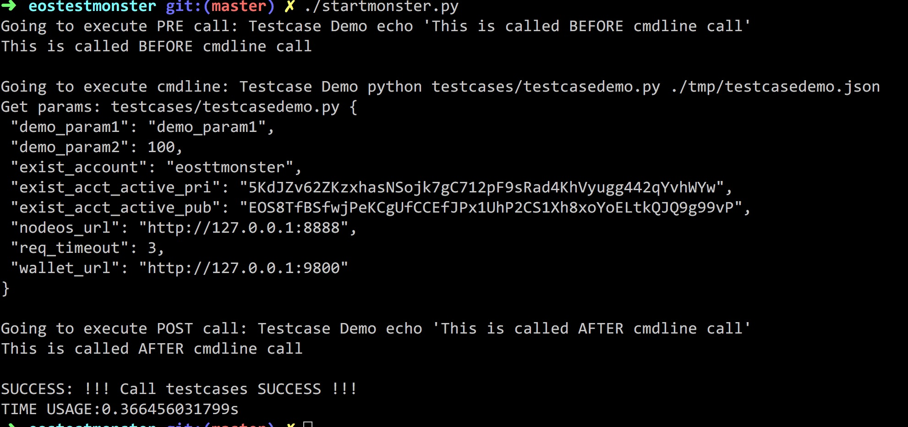

# eostestmonster
Collection of EOSIO function testcase scripts from the community

从社区收集EOSIO函数testcase脚本

主要功能：
    方便对主网的功能进行测试。

原理：
startmonster.py 会循环调用，并把 common_params 和 testcase指定的param合并，存储到./tmp目录下面一个文件，在调用 cmdline 时作为第一个参数传递进去，然后通过testcase 文件夹中的程序进行解析。

操作步骤：

1.在config.json中增加testcase信息、对应参数

2.在testcase/文件夹下写想要测试的功能。

3.运行startmoster.py

