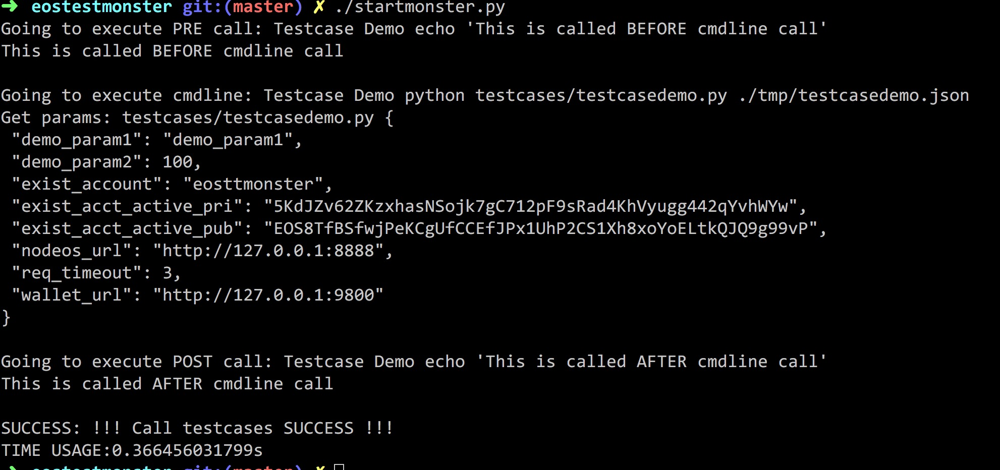

# eostestmonster
社区EOSIO函数testcase脚本集合。

主要功能：方便对主网的功能进行测试。

该项目需要使用 **Python3**, 为了未来。

[Click to view in English](README.md)

## 原理

startmonster.py 会循环调用，并把 common_params 和 testcase指定的param合并，存储到./tmp目录下面一个文件，在调用 cmdline 时作为第一个参数传递进去，然后通过testcase 文件夹中的程序进行解析。

Operation steps:

操作步骤：

1. 在`config.json`中增加 testcase 信息、对应参数

2. 在`testcases/` 文件夹下写想要测试的功能。

   示例 `config.json`:

   ```
   {
     "common_params": {
       "nodeos_url": "http://127.0.0.1:8888",
       "wallet_url": "http://127.0.0.1:9800",
       "exist_account": "eosttmonster",
       "exist_acct_active_pub": "EOS8TfBSfwjPeKCgUfCCEfJPx1UhP2CS1Xh8xoYoELtkQJQ9g99vP",
       "exist_acct_active_pri": "5KdJZv62ZKzxhasNSojk7gC712pF9sRad4KhVyugg442qYvhWYw",
       "req_timeout": 3
     },
     "testcases": [
       {
         "casename": "Testcase Demo",
         "pre_call": "echo 'This is called BEFORE cmdline call'",
         "post_call": "echo 'This is called AFTER cmdline call'",
         "stoponfail": "true",
         "cmdline": "python testcases/testcasedemo.py",
         "params": {
           "demo_param1": "demo_param1",
           "demo_param2": 100
         }
       }
     ]
   }
   ```

3. 运行startmoster.py


